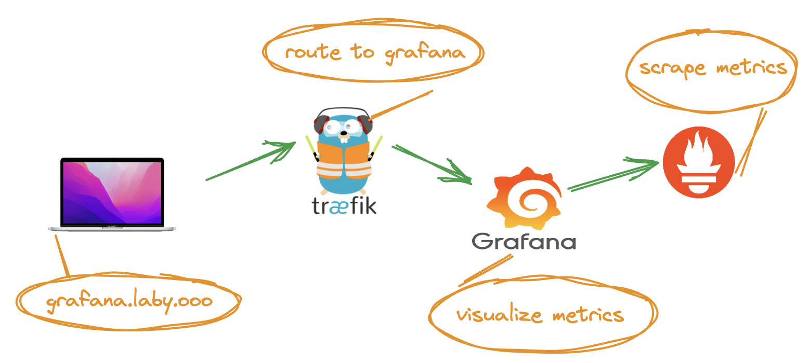
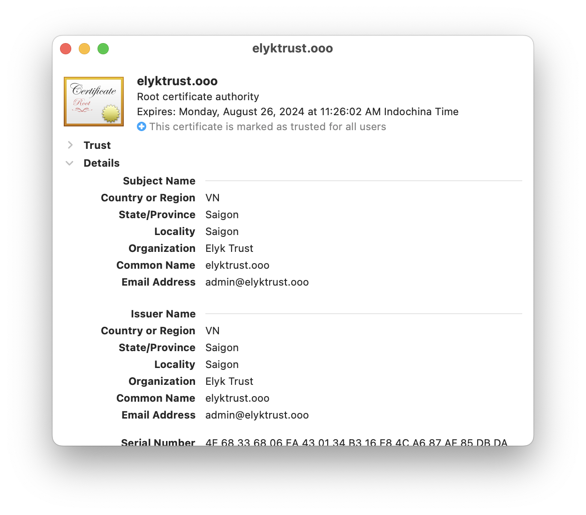
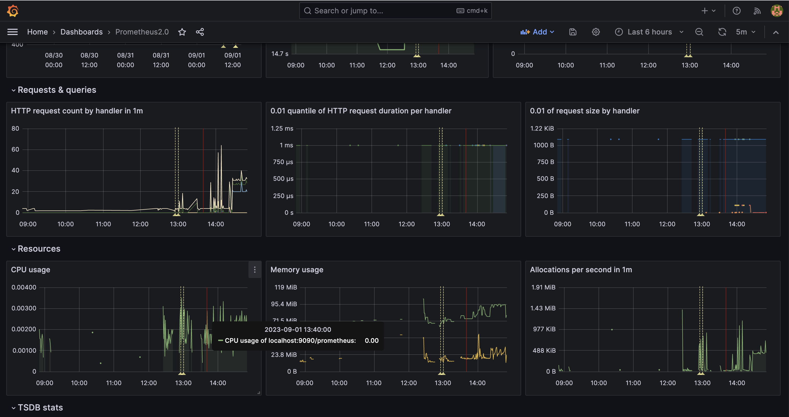

# laby
My lab in with domain `laby.ooo`

This is to demo the a Web application interacting with Database. And the traffic is routed by a Reverse Proxy.

The application is a Grafana dashboard to visualize Prometheus metrics


## Local host file edit
```
/etc/hosts
127.0.0.1 grafana.laby.ooo
127.0.0.1 laby.ooo
127.0.0.1 www.laby.ooo
```

## Local CA
```
openssl genpkey -algorithm RSA -out ca.key
openssl req -new -x509 -key ca.key -out ca.crt
```

## Add LocalCA to MacOS Keychain
This is to make Chrome trust the above SelfSigned custom generated CA

1. Double click on ca.crt to add it to MacOS Keychain
2. Open Keychain -> Highlight the ca.crt -> Right click -> Get info
3. Change to Trust



## Private Key and CSR generating
```
openssl req -new -key laby.ooo.key -out laby.ooo.csr -subj "/CN=*.laby.ooo"
```

## Sign CSR with Local CA
```
openssl x509 -req -in laby.ooo.csr -CA ./ca/ca.crt -CAkey ./ca/ca.key -CAcreateserial -extfile ./ca/openssl.ss.cnf -out laby.ooo.crt -days 730 -sha256
```

## Run it !
```
docker-compose up
```

## Access the App
1. Open Chrome or whatever browser
2. Type https://grafana.laby.oo
3. Default username and password are 'admin'
4. Add whatever Prometheus dashboard available on Grafana dashboards page


